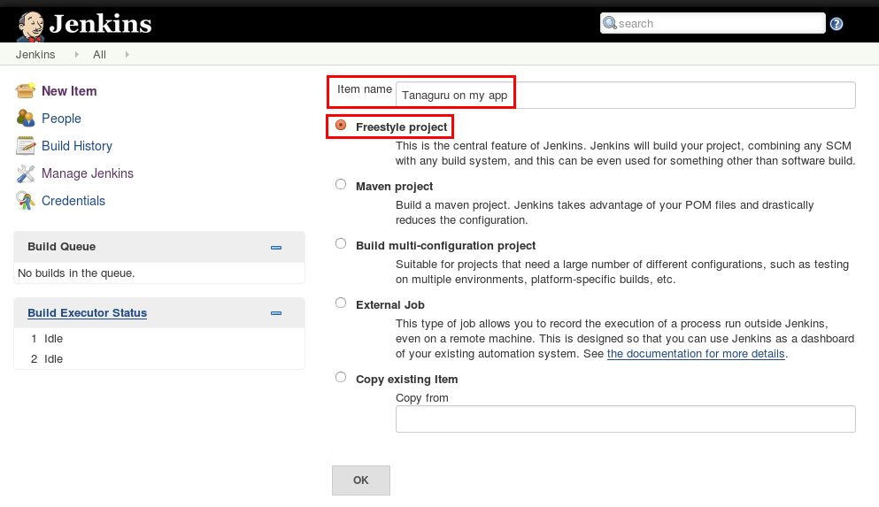
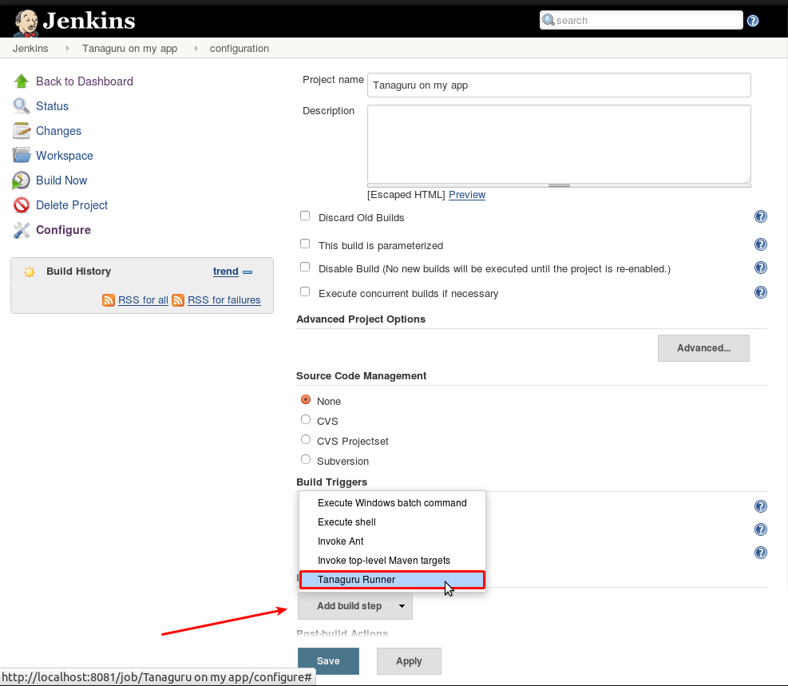
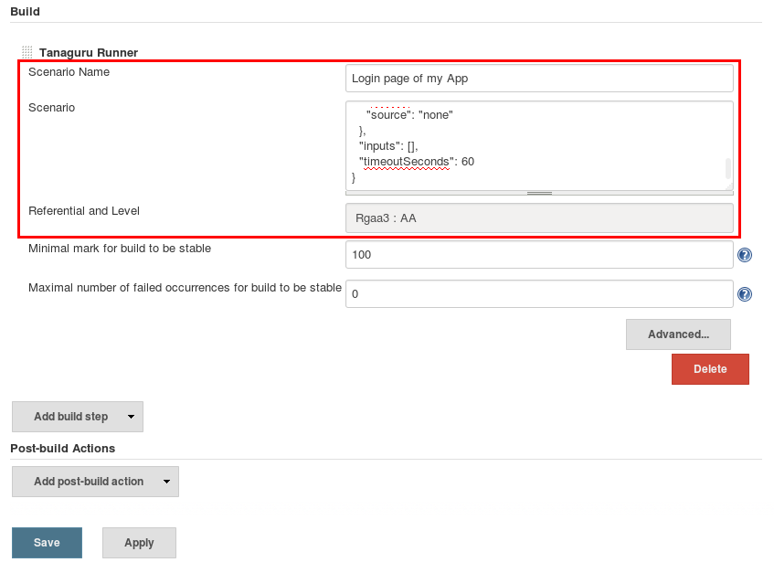
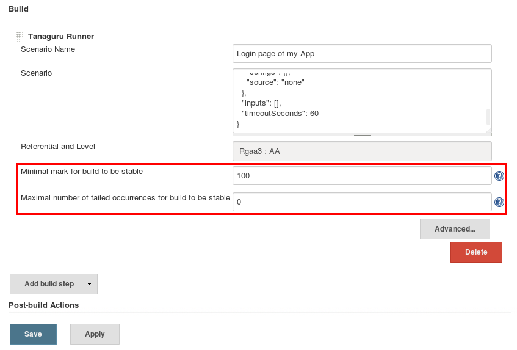

# Configuration of item

## Create a new item

* Give it a name, let say "Tanaguru on myApp"
* Let the item be *freestyle project*

## Add build step

* Add a build step
* Select *Tanaguru Runner*

## Configure build step

* Name the scenario
* Copy/paste the scenario you will have create (see [Tanaguru scenario user documentation](@@@ Link to add))
* Choose the Referentiel and Level (if you don't what to choose, elect *Rgaa3: AA*)
* Save

## Links between Jenkins and Tanaguru

Here are a few important things to know.

* Each item will **automatically create a contract** for [Tanaguru user configured for Jenkins](configuration#tanaguru-account-login-mandatory)
just after the first build. The contract name will be the item name. The contract
will have the scenario feature activated. The scenario name will be the one just given.
* Renaming an item **does not rename** the associated Tanaguru project, a new project is created instead.
* Renaming the scenario or changing its content, will **add a new scenario** to project.
The old scenario will be kept in Tanaguru, but will be no more executed by Jenkins.
* In Tanaguru, the project page contains the history of last audits. Each audit is named
as the concatenation of the scenario name and the job build number given by Jenkins

## Define when a build is stable / unstable

You have two metrics to define the stability of a build:

* Minimal mark (Tanaguru Meter)
* Maximal number of failed occurrences

Default values are the following ones:

* Minimal mark: 100 (percentage)
* Maximal number of failed occurrences: 0 (absolute value) 

## Next step

proceed to [Usage](usage.md)

