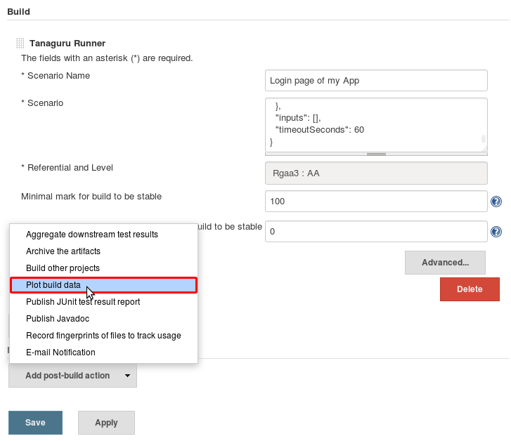
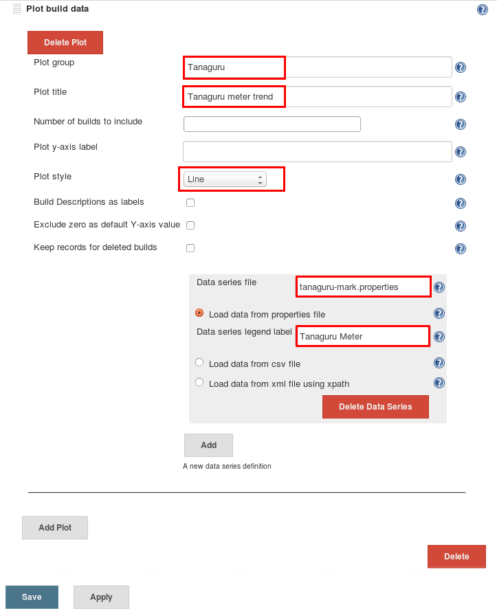
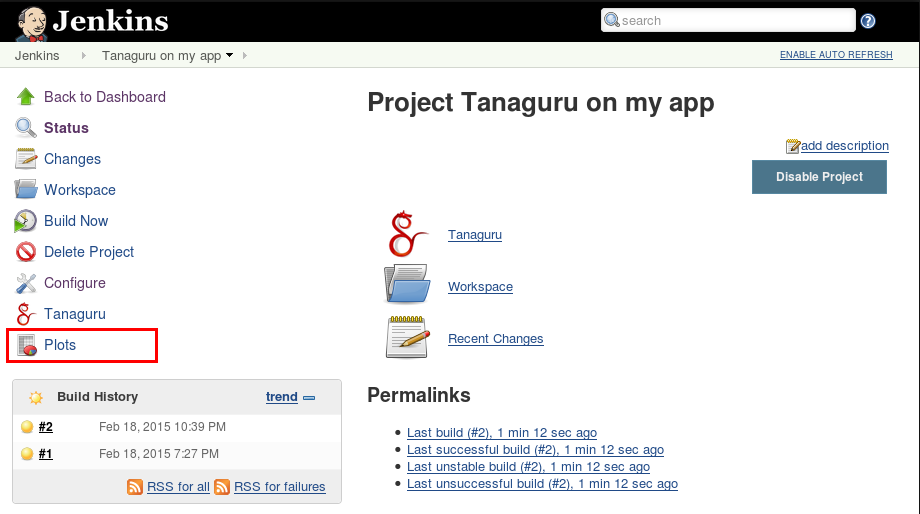
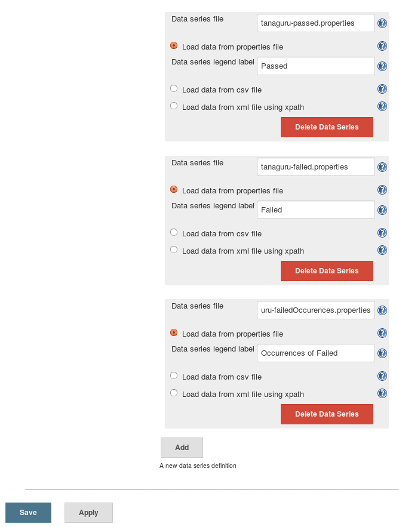
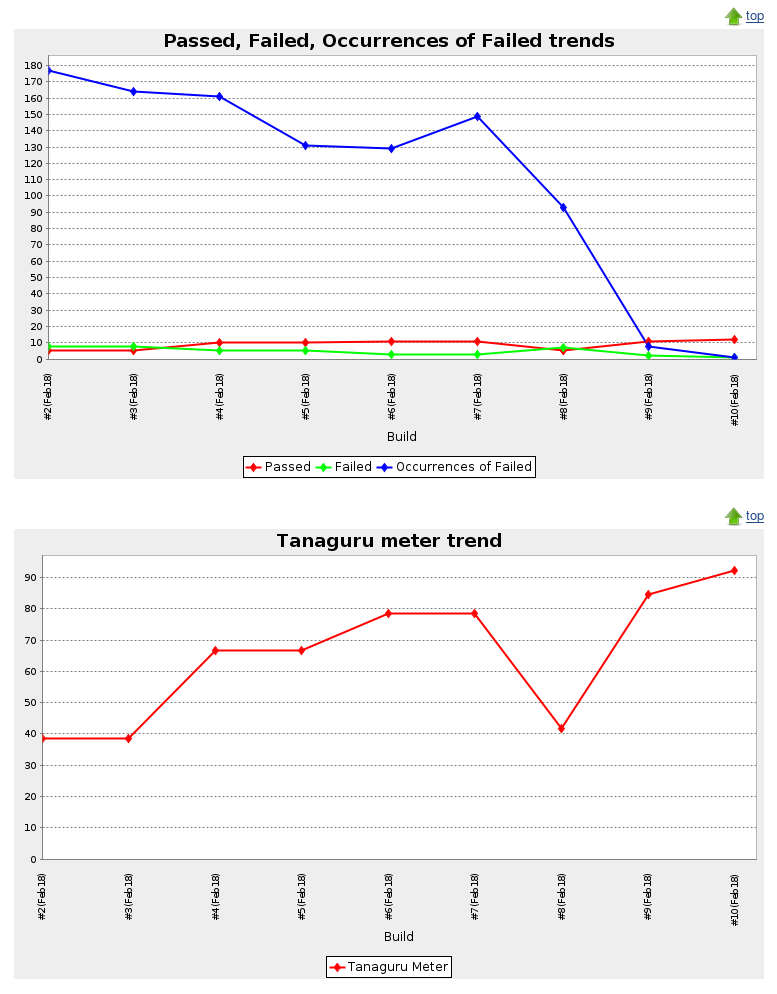
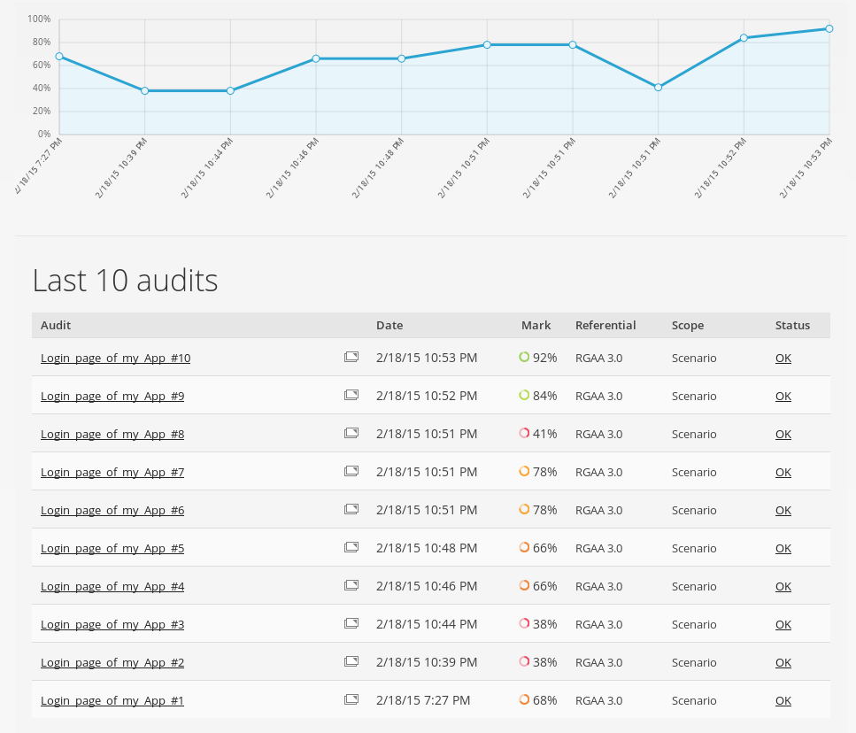

# Creating and customizing graphs with Tanaguru Jenkins Plugin

Reminder: Plot plugin must have been installed.

## Metrics available for graphs

Tanaguru Jenkins plugin exposes various metrics that can be graphed.

* `tanaguru-mark.properties`: the score (Tanaguru Meter), percentage value
* `tanaguru-passed.properties`: number of Passed tests, absolute value
* `tanaguru-failed.properties`: number of Failed tests, absolute value
* `tanaguru-failedOccurences.properties`: total number of occurrences of Failed over all tests
* `tanaguru-nmi.properties`: number of Pre-Qualified tests, absolute value
* `tanaguru-na.properties`: number of Not Applicable tests, absolute value
* `tanaguru-nt.properties`: number of Not Tested tests, absolute value

## Create a graph

From the item page, go to *Configure*, *Add post-build action* and choose *Plot build data*.

## Customize the graph

Fill in the following fields:

* Plot group: give a name, let say *Tanaguru*
* Plot title: let say *Tanaguru meter trend*
* Plot style: let choose *Line*. Other styles are available:
    * Area
    * Bar
    * Bar 3D
    * Line
    * Line 3D
    * Stacked Area
    * Stacked Bar
    * Stacked Bar 3D
    * Waterfall
* Data series file: choose one of the [Metrics available for graphs](#metrics-available-for-graphs), let say `tanaguru-mark.properties`
* Data series legend label: let say `Tanaguru meter`

Save, have some build done and view the graph.

## View graphs

To view the graphs, from the an Item page, click on the *Plots* links

## Different metrics on the same graph

When creating a graph, add several *data series*. For example, to graph the number
of Passed, Failed and Failed occurrences, add three data series.

## Example of graphs

Graphs generated by Jenkins

Same *Tanaguru Meter trend* graph from Tanaguru interface

