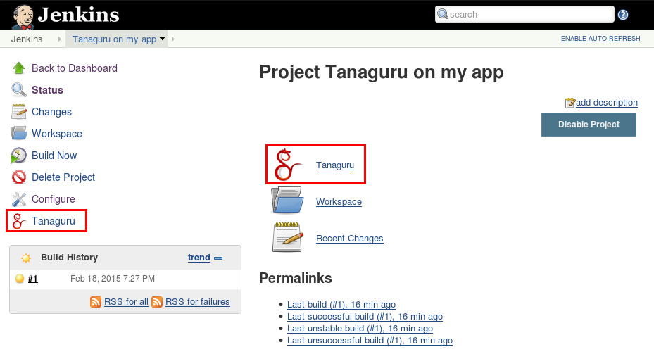

# Usage

Once Tanaguru Jenkins plugin is configured, and you have created and configured an item, you can actually use the plugin.

## Run the build

Launch the build (*Build now* link or icon *Schedule build*)

## View the results (raw)

Results in raw mode can be viewed from the *Console output* of the item

## View the results (from Tanaguru interface)

You can have an extensive and detailed view of the audit within Tanaguru interface.
To access it, from the Item page, click on the *Tanaguru* link.

